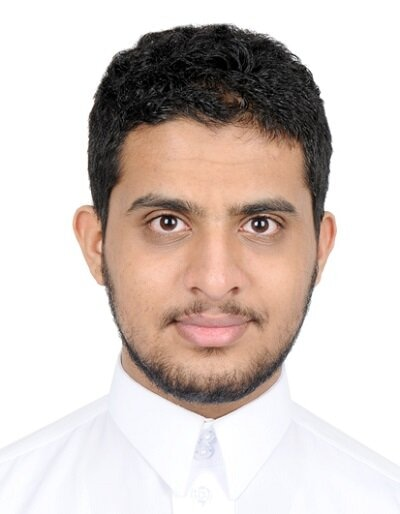
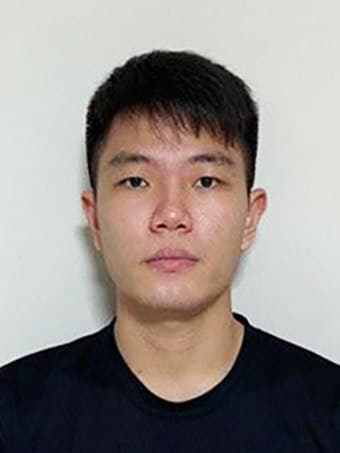

We are a team based in the [School of Computing, National University of Singapore](http://www.comp.nus.edu.sg).

You can reach us at the email `seer[at]comp.nus.edu.sg`

## Project team

### John Doe

[[homepage](http://www.comp.nus.edu.sg/~damithch)]
[[github](https://github.com/johndoe)]
[[portfolio](team/johndoe.md)]

* Role: Project Advisor

### Tan Juay Hee

[[github](http://github.com/juayhee)]
[[portfolio](team/juayhee.md)]

* Role: Code Quality and Testing
* Responsibilities: Ensures the testing of the project is done properly and on time; looks
after code quality and ensures adherence to coding standards.

### Abdulelah Faisal S Al Ghrairy

[[github](http://github.com/aalghrairy)] [[portfolio](team/aalghrairy.md)]

* Role:  Deliverables and Deadline
* Responsibilities: Ensure project deliverables are done on time and in the right format

### Sim Jun Heng

[[github](http://github.com/simjunheng)]
[[portfolio](team/simjunheng.md)]

* Role: Documentation and Integration
* Responsibilities: In charge of versioning, repository maintenance, and code integration. Assist and ensure
that all documentations are in-order.

### James Doe

[[github](http://github.com/johndoe)]
[[portfolio](team/johndoe.md)]

* Role: Developer
* Responsibilities: UI
