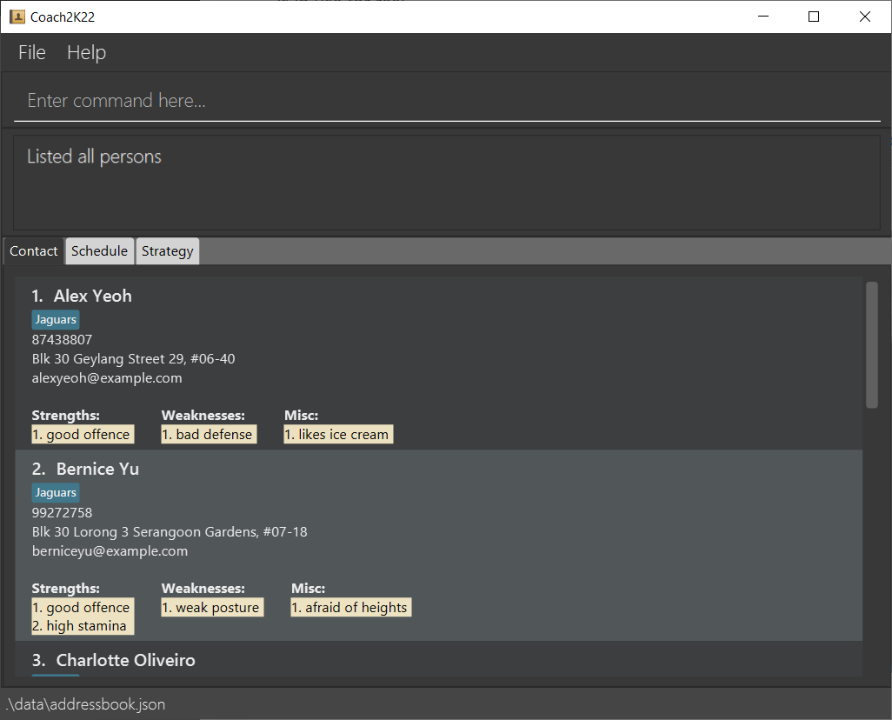

#User Guide

Coach2K22 is a desktop app that helps busy sports coaches **organise their overwhelming lists of contacts and messy weekly schedules.** It also provides them with a **platform to visualise defensive and offensive plays** as the game unfolds

* Table of Contents
{:toc}

--------------------------------------------------------------------------------------------------------------------

## Quick start

1. Ensure you have Java `11` or above installed in your Computer.

1. Download the latest '.jar' file.

1. Copy the file to the folder you want to use as the _home folder_ for your copy of Coach2k22.

1. Double-click the file to start the app. The GUI similar to the below should appear in a few seconds. Note how the app contains some sample data. 
   

1. Type the command in the command box and press Enter to execute it. e.g. typing **`help`** and pressing Enter will list all the possible commands. 
   Some example commands you can try:

   * **`list`** : Lists all contacts.

   * **`add`**`n/John Doe p/98765432 e/johnd@example.com` : Adds a contact named `John Doe`.

   * **`delete`**`3` : Deletes the 3rd contact shown in the current list.

   * **`exit`** : Exits the app.

1. Refer to the [Features](#features) below for details of each command.

--------------------------------------------------------------------------------------------------------------------

## Features

**:information_source: Notes about the command format:** 

* Words in `UPPER_CASE` are the parameters to be supplied by the user. 
  e.g. in `add n/NAME`, `NAME` is a parameter which can be used as `add n/John Doe`.

* Items in square brackets are optional. 
  e.g `n/NAME [t/TAG]` can be used as `n/John Doe t/friend` or as `n/John Doe`.

* Items with `…`​ after them can be used multiple times including zero times. 
  e.g. `[t/TAG]…​` can be used as ` ` (i.e. 0 times), `t/friend`, `t/friend t/family` etc.

* Parameters can be in any order. 
  e.g. if the command specifies `n/NAME p/PHONE_NUMBER`, `p/PHONE_NUMBER n/NAME` is also acceptable.

* If a parameter is expected only once in the command but you specified it multiple times, only the last occurrence of the parameter will be taken. 
  e.g. if you specify `p/12341234 p/56785678`, only `p/56785678` will be taken.

* Extraneous parameters for commands that do not take in parameters (such as `help`, `list`, `exit` and `clear`) will be ignored. 
  e.g. if the command specifies `help 123`, it will be interpreted as `help`.

### Listing all contacts : `list`

Shows a list of all persons in our contact list.

Format: `list`

### Adding a person: `add`

Adds a person to our contact list.

Format: `add n/NAME p/PHONE_NUMBER e/EMAIL [t/TAG_NAME]…​`

:bulb: **Tip:**
A person can have any number of tags (including 0)

Examples:
* `add n/Johnson p/83918273 e/johnson@gmail.com t/Hustlers`

### Deleting a person: `del`

Delete a person from our contact list.

Format: `del INDEX`

Examples:
* `del 1` deletes the first person in the contact list.

### Adding a tag : `tag-add`

Add tags to a selected person from our contact list.

Format: `tag-add INDEX  TAG_NAME`

Examples:
* `tag-add 1 Public Relations` adds the tag `Public Relations` to the first person in the contact list.

### Deleting a tag : `tag-del`

Add tags to a selected person from our contact list.

Format: `tag-del INDEX  TAG_INDEX`

Examples:
* `tag-del 1 1` deletes the first tag from the first person in the contact list.

### Locating persons by keyword : `find`

Find persons matching any of the given keywords from our contact list.
Users can choose to find by `NAME`(s), `TAG`(s), or both.

Format: `find [n/NAME]…​ [t/TAG]…​`

* One of the optional items e.g. `[n/NAME]` must be present for the command to work. 

Examples:
* `find n/Alan t/team1`
* `find n/Alan`
* `find t/team1`
* `find n/Alex n/Charlotte t/team1 t/team2`

### Adding a strength : `strength-add`

Add a strength to a selected person from our contact list.

Format: `strength-add INDEX  STRENGTH_DESCRIPTION`

Examples:
* `strength-add 1 Great stamina` adds the strength "Great stamina" to the 1st person in the contact list.

### Adding a weakness : `weakness-add`

Add a weakness to a selected person from our contact list.

Format: `weakness-add INDEX  WEAKNESS_DESCRIPTION`

Examples:
* `weakness-add 1 Poor defensive abilities` adds the weakness "Poor defensive abilities" to the 1st person in the contact list.

### Adding a miscellaneous note : `misc-add`

Add a miscellaneous note to a selected person from our contact list.

Format: `misc-add INDEX  NOTE_DESCRIPTION`

Examples:
* `note-add 1 Likes ice cream` adds the miscellaneous note "Likes ice cream" to the 1st person in the contact list.

### Deleting a strength : `strength-del`

Delete a strength from a selected person from our contact list.

Format: `strength-del INDEX  STRENGTH_INDEX`

* Deletes the strength at the specified `INDEX`.
* The index refers to the index number shown in the displayed person list.
* The strength index refers to the index number shown in the strength list of the respective person.
* Both indices **must be a positive integer** 1, 2, 3, …​

Examples:
* `strength-del 1 1` deletes the first strength from the first person in the contact list.

### Deleting a weakness : `weakness-del`

Delete the weakness from a selected person from our contact list.

Format: `weakness-del INDEX  WEAKNESS_INDEX`

* Deletes the WEAKNESS at the specified `INDEX`.
* The index refers to the index number shown in the displayed person list.
* The weakness index refers to the index number shown in the weakness list of the respective person.
* Both indices **must be a positive integer** 1, 2, 3, …​

Examples:
* `weakness-del 1 1` deletes the first weakness from the first person in the contact list.

### Deleting a miscellaneous  note : `misc-del`

Delete the miscellaneous note from a selected person from our contact list.

Format: `misc-del INDEX  NOTE_INDEX`

* Deletes the miscellaneous note at the specified `INDEX`.
* The index refers to the index number shown in the displayed person list.
* The note index refers to the index number shown in the misc. list of the respective person.
* Both indices **must be a positive integer** 1, 2, 3, …​

Examples:
* `misc-del 1 1` deletes the first miscellaneous note from the first person in the contact list.

### Clear all task entries : `clear-t`

Clear all tasks or tasks on a selected date from our task list.

Format: `clear-t [d/DATE]`

* Clears all tasks on the specified `INDEX`.
* Date must be in the format `yyyy-mm-dd`.

Examples:
* `clear-t 2022-10-10` clears all tasks on the date given.

### Load new background image : `load-court`

Load a new background image in the strategy tab.

Format: `load-court FILEPATH`

* Loads the given image from the specified `FILEPATH`.
* File must exist and be in `png` format.

Examples:
* `load-court images/basketball.png` loads and sets the image `basketball.png` as the background image of strategy tab.

### Listing all the commands : `help`

Show a list of all the commands with their respective format and a short description of what they do.

Format: `help`

### Exiting the program : `exit`

Exits the program.

Format: `exit`

--------------------------------------------------------------------------------------------------------------------

## FAQ

**Q**: How do I transfer my data to another Computer? 
**A**: Install the app in the other computer and overwrite the empty data file it creates with the file that contains the data of your previous Coach2k22 home folder.

--------------------------------------------------------------------------------------------------------------------

## Command summary

| Action       | Format, Examples                                                                                                   |
|--------------|--------------------------------------------------------------------------------------------------------------------|
| **List**     | `list`                                                                                                             |
| **Add**      | `add n/NAME p/PHONE_NUMBER e/EMAIL [t/TAG]…​`   e.g., `add n/Johnson p/83918273 e/johnson@gmail.com t/Hustlers` |
| **Del**      | `del INDEX`  e.g., `del 1`                                                                                      |
| **Add Tag**  | `tag-add INDEX  TAG_NAME`  e.g., `tag-add 1 Public Relations`                                                   |
| **Del Tag**  | `tag-del INDEX  TAG_INDEX`  e.g., `tag-del 1 1`                                                                 |
| **Find**     | `find [n/NAME]…​ [t/TAG]…​`  e.g., `find n/Alex n/Charlotte t/team1 t/team2`                                                     |
| **Add Note** | `note-add INDEX  NOTE_DESCRIPTION`  e.g., `note-add 1 Surgery Scheduled for tomorrow`                           |
| **Del Note** | `note-del INDEX  NOTE_INDEX`  e.g., `note-del 1 1`                                                              |
| **Help**     | `help`                                                                                                             |
| **Exit**     | `exit`                                                                                                             |
